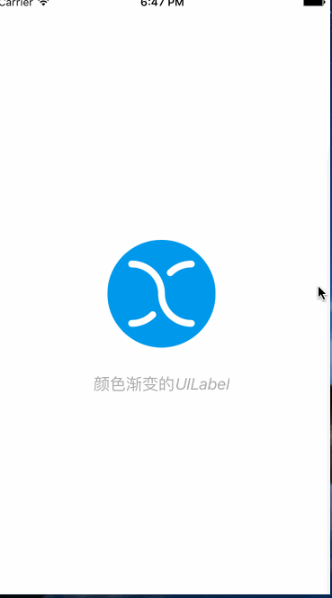

# GradientLabel
为UILabe添加颜色渐变效果的Category

## 0x00 效果如下


## 0x01 使用

```objective-c
#import "UILabel+Gradient.h"
```

```objective-c
NSValue *v1 = [NSValue valueWithVector:GradientVectorMake(0,1,0,0)];
NSValue *v2 = [NSValue valueWithVector:GradientVectorMake(1,0,0,0)];
NSValue *v3 = [NSValue valueWithVector:GradientVectorMake(0,1,1,0)];

UIColor *c1 = RGBCOLOR(84, 84, 84);
UIColor *c2 = RGBCOLOR(67, 145, 204);
UIColor *c3 = RGBCOLOR(101, 204, 121);

[_titleLabel addGradientColors:@[c1,c2,c3]
                     intervals:@[@(1.8),@(1.2),@(1.4)]
                       vectors:@[v1,v2,v3]
                        hideen:YES
                   finishBlock:^{
                       NSLog(@"渐变完成了");
                       [self imageAnimation];
}];
```

## 0x02 一些常用颜色渐变方向向量
- 从左向右
```objective-c
GradientVectorMake(0,0,1,0)
```
- 从右向左
```objective-c
GradientVectorMake(1,0,0,0)
```
- 从上向下
```objective-c
GradientVectorMake(0,0,0,1)
```
- 从下向上
```objective-c
GradientVectorMake(0,1,0,0)
```
- 从左上向右下
```objective-c
GradientVectorMake(0,0,1,1)
```
- 从右下向左上
```objective-c
GradientVectorMake(1,1,0,0)
```
- 从左下向右上
```objective-c
GradientVectorMake(0,1,1,0)
```
- 从右上向左下
```objective-c
GradientVectorMake(1,0,0,1)
```
